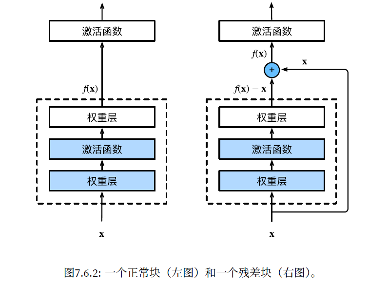
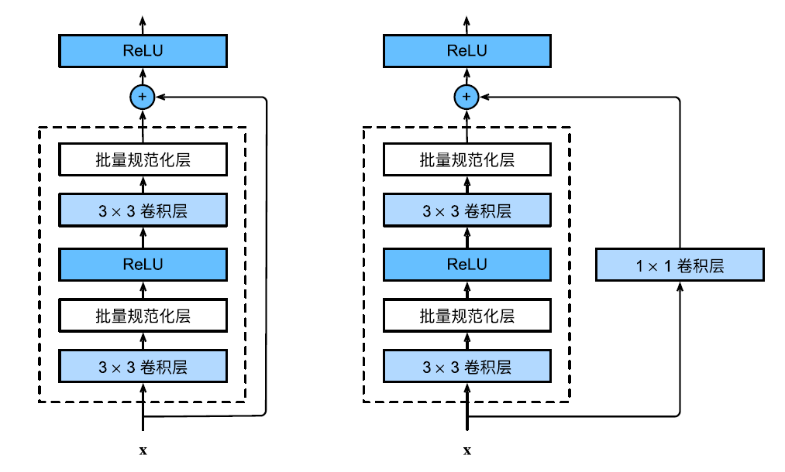
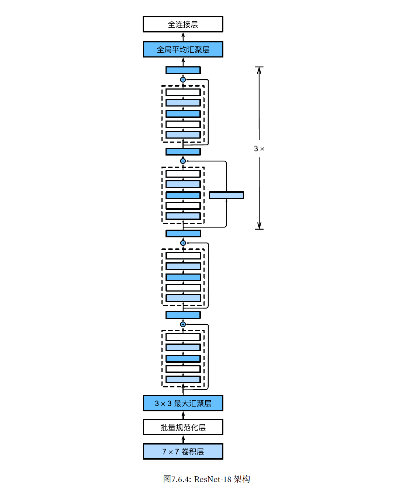

由于在$icode$项目的小狗特征类别识别中，我们希望用的模型是$ResNet50$，因此在这里先记录一下这个模型的学习过程。

本期博客主要内容：
1. 函数类
2. 残差块
3. ResNet模型

<!-- more -->

---

## **函数类**

我们尝试找到一个函数$f_F^t$，使得它为F中的最佳选择。我们可以尝试解决一下的优化问题来找到它：

$$
f_F^t = argmin_fL(X,y,f),f \in F
$$

我们可以找到一个更强大的架构F^'，我们预计$f_{F^{'}}^{t}$比$f_F^t$更接近

但这只有在嵌套函数中才可以找到，称这样的函数集合称为函数类。

如果我们可以将新添加的层训练成恒等函数$f(x)=x$，那么新模型将与原模型一样有效。

## **残差块**

核心思想：每个附加层都应该更容易包含原始函数作为其元素之一。

残差块的样式如下：

假设我们的输入为$x$，需要学习的理想映射是$f(x)$。左图中的部分直接拟合出映射$f(x)$，而右图使用了残差映射的思想，只需要拟合出$f(x)-x$，残差映射在现实中往往更容易优化。

并且，残差映射也更容易捕获恒等函数的细微波动。

在卷积层与全连接层之前，相应的激活函数之后，我们使用一种称为批量规范化的优化方法（BatchNorm），这是一种防止过拟合的方法。

从形式上来说，用$x \in B$，表示一个来自小批量$B$的输入，批量规范化$BN$：

$$
BN(x)=\gamma  \odot \frac{x-\mu_B}{\sigma_B} + \beta \\ 
\mu_B = \frac{1}{|B|}\Sigma_{x \in B} x \\
\sigma_B^2 = \frac{1}{|B|}\Sigma(x-\mu_B)^2+\epsilon
$$

## **ResNet模型**

ResNet模型在每个卷积层之后增加了批量规范层，随后加上所有残差块，最后加入全局平均汇聚层以及全连接输出。

