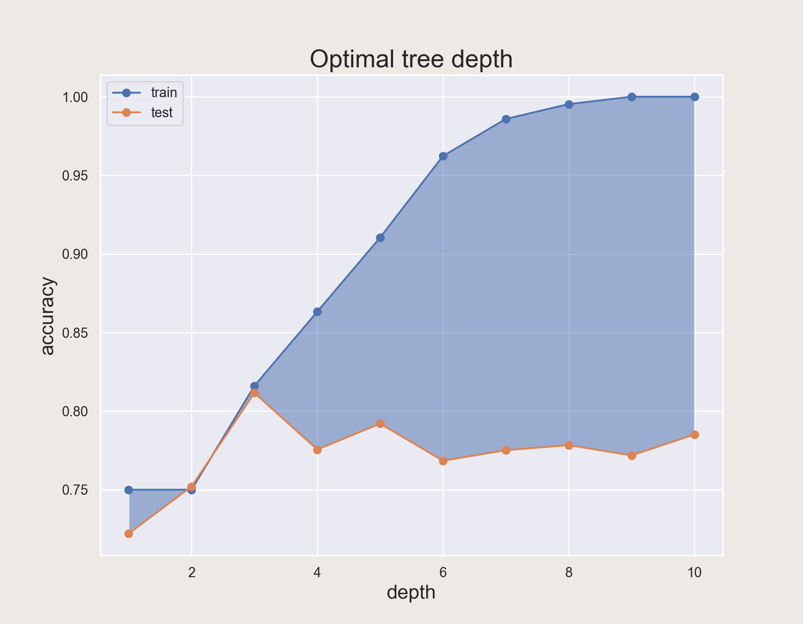
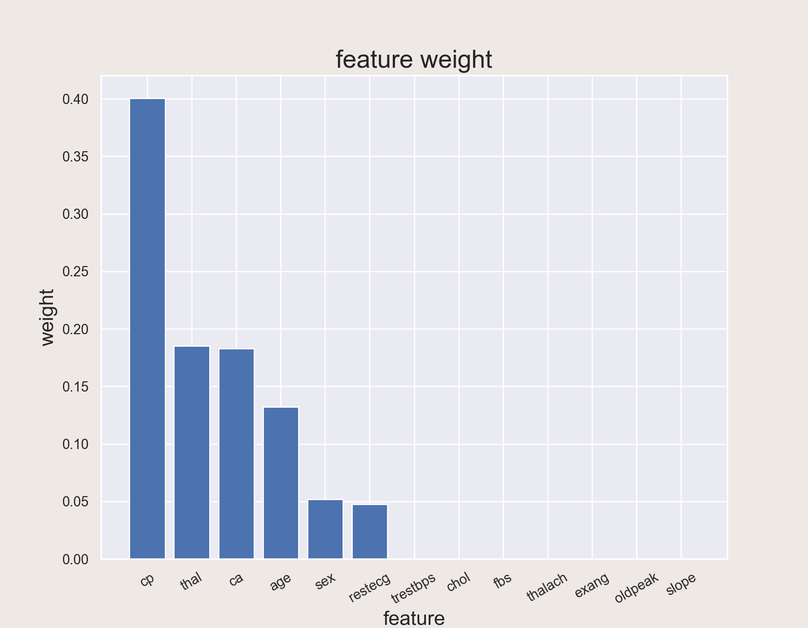

## **基本流程与特性**

决策树是一类常见的机器学习算法。

一般的，决策树包含一个根节点、若干个内部节点和若干个叶结点。叶结点对应于决策结果，其他的每个结点则对应一个属性测试。

决策树的生成是一个递归过程，有三种情形会导致递归返回：

1. 当前结点包含的样本全属于一个类别；
2. 当前属性集为空，或是所有样本在所有属性上取值相同，无法划分；
3. 当前结点包含的样本集合为空，无法划分。

<!-- more -->

## **划分选择**

决策树如何选择最优划分属性是非常重要的，我们当然希望决策树的分支结点所包含的样本尽可能属于同一个类别，即结点的纯度越来越高，于是我们引入一个信息熵的概念。

**信息熵**是度量样本集合纯度最常用的一种指标。假定当前样本集合$D$中第$k$类样本所占的比例为$p_k$，则$D$的信息熵定义为：
$$
Ent(D)=-\Sigma_{k=1}^{|\gamma|}p_klog_2p_k
$$
并且有：$Ent(D)$的值越小，$D$的纯度越高。

**信息增益**是判断某个属性进行划分时，结点纯度提升多少的标准。一般而言，信息增益越大，意味着使用这个属性来进行划分所获得的纯度提升越大。著名的$ID3$决策树学习算法就是以信息增益为准则来选择划分属性。我们假定离散属性$a$有$V$个可能的取值，若使用$a$来对集合$D$进行划分，则会产生$V$个分支结点，其中第$v$个分支包含了$D$在所有属性$a$上取值为$a^v$的样本，记为$D^v$，则属性$a$对样本集$D$进行划分所获得的的信息增益为：
$$
Gain(D,a)=Ent(D)-\Sigma_{v=1}^{V}\frac{|D^v|}{|D|}Ent(D^v)
$$
然而，并不是所有的决策树都使用增益率作为最优划分属性的标准：

$C4.5$决策树算法使用：
$$
Gain\_radio(D,a)=\frac{Gain(D,a)}{IV(a)}\newline
IV(a)=-\Sigma_{v=1}^{V}\frac{|D^v|}{|D|}log_2\frac{|D^v|}{|D|}
$$
$CART$决策树使用基尼系数：
$$
Gini(D)=1-\Sigma_{k=1}^{|\gamma|}p_k^2\newline
Gini\_index(D,a)=\Sigma_{v=1}^V\frac{|D^v|}{|D|}Gini(D^v)\newline
a_*=argmin_{a \in A}Gini\_index(D,a)
$$

## **剪枝处理**

剪枝是决策树算法对付过拟合的主要手段，主要分为以下两种：

1. 预剪枝：划分前进行估计，判断是否能对决策树带来泛化性能提升；
2. 后剪枝：训练集生成一棵完整的决策树，然后自底向上的对非叶子结点进行考察。

## **决策树优缺点**

### **优点**

1. 直观，好理解，便于可视化；
2. 在决策树的训练过程中，可以根据最优划分属性的标准，得到各个属性的权重；
3. 可以处理含有缺失值的数据。

### **缺点**

1. 对于树的最大深度这个参数非常敏感；
2. 对于类别越多的数据，判断的正确性越低；
3. 计算效率不高。

## **实战一手：心脏病预测**

这里的数据取自百度飞桨：[心脏病预测 - 飞桨AI Studio (baidu.com)](https://aistudio.baidu.com/aistudio/datasetdetail/108029/0)

**数据描述**

该数据库包含76个属性，但是所有已发布的实验都引用了其中14个属性的子集。尤其是，克利夫兰数据库是迄今为止ML研究人员使用的唯一数据库。
“目标”字段是指患者中是否存在心脏病。它是整数值，0=心脏病发作的机会不多/ 1=心脏病发作的机会更多

**属性信息**

1. 年龄 
2. 性别 
3. 胸痛类型（4个值） 
4. 静息血压 
5. 血清胆固醇水平$(mg / dl)$ 
6. 空腹血糖$> 120 mg / dl$ 
7. 静息心电图结果（值$0,1,2$） 
8. 达到最大心率 
9. 运动引起的心绞痛 
10. 运动导致的ST抑郁相对于休息引起的ST压低 
11. 运动ST段的峰值斜率 
12. 荧光造影显着的主要血管数目（$0$-$3$） 
13. thal：0=正常；1=固定缺陷；2=可逆缺陷 
14. 目标：0=心脏病发作的机会减少/1=心脏病发作的机会增加

### **绘图**

#### **最大深度选取**



#### **特征权重比较**



#### **可视化决策树**



### **完整代码如下：**

```python
import os
import numpy as np
import pandas as pd
import matplotlib.pyplot as plt
import seaborn as sns
from sklearn.model_selection import train_test_split
from sklearn import tree
from sklearn.model_selection import GridSearchCV, cross_val_score  # 网格搜索，交叉验证
from sklearn.tree import DecisionTreeClassifier
import graphviz

sns.set()

print(os.getcwd())
df = pd.read_csv('heart.csv')

# 基本信息
# print(df.head())
# print(df.info())

# 切分训练集与测试集
x = df.iloc[:, df.columns != "target"]
y = df.iloc[:, df.columns == "target"]
# print(x)
# print(y)
Xtrain, Xtest, Ytrain, Ytest = train_test_split(x, y, test_size=0.3, random_state=40)
for i in [Xtrain, Xtest, Ytrain, Ytest]:
    i.index = range(i.shape[0])

# 查找最合适的最大树深
tr = []
te = []
for i in range(10):
    clf = DecisionTreeClassifier(random_state=25, max_depth=i + 1, criterion="entropy")
    clf = clf.fit(Xtrain, Ytrain)
    score_tr = clf.score(Xtrain, Ytrain)
    score_te = cross_val_score(clf, x, y, cv=10).mean()
    tr.append(score_tr)
    te.append(score_te)
# print(max(te))
plt.figure(figsize=(9, 7), dpi=200, facecolor="#EFE9E6")
plt.plot(range(1, 11), tr, marker='o', label="train")
plt.plot(range(1, 11), te, marker='o', label="test")
plt.fill_between(x=range(1, 11), y1=tr, y2=te, alpha=0.5)

plt.xlabel('depth', fontsize=16)
plt.ylabel('accuracy', fontsize=16)
plt.title('Optimal tree depth', fontsize=20)
plt.legend()
plt.savefig('Optimal-tree-depth')
plt.show()

# 网格搜索
parameters = {
    "min_samples_leaf": [*range(1, 20)],
    "min_impurity_decrease": [*np.linspace(0, 0.01, 1)]
}

clf = DecisionTreeClassifier(random_state=25,
                             max_depth=3,
                             criterion="entropy",
                             min_samples_leaf=11,
                             min_impurity_decrease=0.0)
GS = GridSearchCV(clf, parameters, cv=10)
GS = GS.fit(Xtrain, Ytrain)

# print(GS.best_params_)
# print(GS.best_score_)

# 决策树模型的训练
clf = DecisionTreeClassifier(random_state=25,
                             max_depth=3,
                             criterion="entropy",
                             min_samples_leaf=11,
                             min_impurity_decrease=0.0)
clf.fit(Xtrain, Ytrain)

# 综合得分
score = clf.score(Xtest, Ytest)
print('综合得分 =', score)

# 交叉验证
score = cross_val_score(clf, x, y, cv=10).mean()
print('交叉验证得分 =', score)

# 各属性值权重
importance = clf.feature_importances_
feature = pd.Series(importance, index=Xtrain.columns)
feature.sort_values(inplace=True, ascending=False)
# print(feature)

# 绘制权重柱状图
plt.figure(figsize=(9, 7), dpi=200, facecolor="#EFE9E6")
plt.bar(feature.index, height=feature)
plt.title('feature weight', fontsize=20)
plt.xlabel('feature', fontsize=16)
plt.ylabel('weight', fontsize=16)
plt.xticks(rotation=30)
plt.savefig('feature-weight')
plt.show()

dot_data = tree.export_graphviz(clf, out_file=None,
                                feature_names=Xtrain.columns,
                                filled=True,
                                rounded=True)
graph = graphviz.Source(dot_data)
graph.render('heart')
graph.view()

# 程序结束
print('Done!')
```
