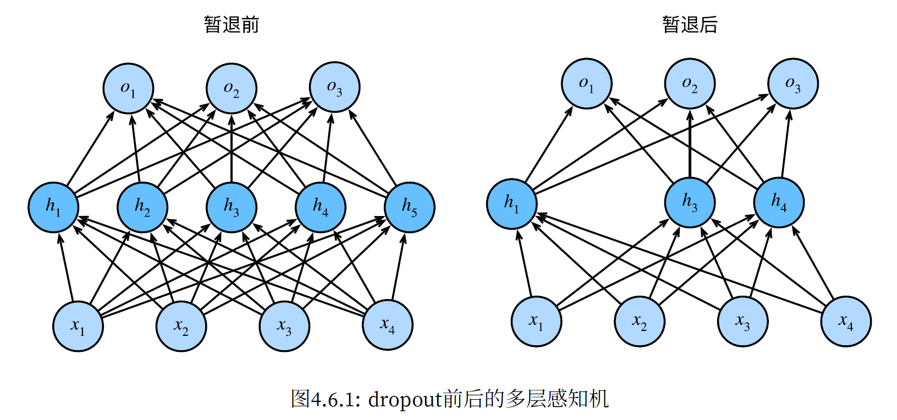

可以在网络中加入一个或多个隐藏层来克服线性模型的限制，使其能处理更普遍的函数关系类型。（最简单的方法是将许多全连接层堆叠在一起）

为了防止多层感知机退化成线性的，我们可以对每个隐藏单元应用一个非线性的激活函数$\sigma$

<!-- more -->

---

**激活函数**（$activation \ function$）通过计算加权和并加上偏置来确定神经元是否应该被激活，它们将输⼊信号转换为输出的可微运算。

常见的激活函数有：$Relu$函数，$Sigmoid$函数，$tanh$函数

其中：
$$
Relu(x) = max(x, 0)
$$

$$
Sigmoid(x) = \frac{1}{1+e^{-x}}
$$

$$
tanh(x) = \frac{1-e^{-2x}}{1+e^{-2x}}
$$

为使得某些负值属性也能够通过$Relu$函数，该函数产生了许多变式，如：参数化$Relu$（$pRelu$函数）：

$$
pRelu(x)=max(x,0)+\alpha min(x,0)
$$

---

下面给出一个多层感知机的简单$pytorch$实现，这里就只给出类定义了。

由三个全连接层实现，输入层有$1024$个结点，隐藏层分别有$256$与$64$个隐藏结点，输出层有$4$个结点

```python
from torch import nn
import torch.nn.functional as F


class Net(nn.Module):
    def __init__(self):
        super(Net, self).__init__()
        self.fc1 = nn.Linear(1024, 256)
        self.fc2 = nn.Linear(256, 64)
        self.fc3 = nn.Linear(64, 4)

    def forward(self, x):
        x = F.relu(self.fc1(x))
        x = F.relu(self.fc2(x))
        x = self.fc3(x)
        return x
```

---

## **防止过拟合的方法**：

1. L2正则化（权重衰减）：增加正则化系数
2. 暂退法：在每一个全连接层后，增加dropout层

L2正则化本质是降低数据的方差以防止过拟合。

暂退法图解：

