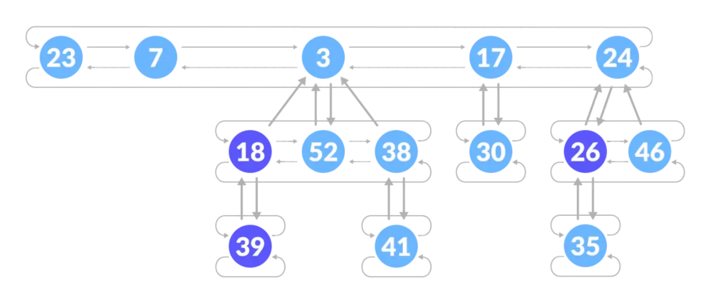

# 斐波那契堆

斐波那契堆是一系列具有最小堆序的有根树的集合。每一棵树均遵循最小堆属性；每个节点的关键字大于或等于它的父节点关键字。

## 斐波那契堆的结构说明

1. 所有树的根都连接在一起，以便更快地访问；
2. 父节点的子节点通过如下所示的循环双向链表相互连接。

使用循环双向链表有两个主要优点：

1. 从树中删除一个节点需要 O(1) 时间；
2. 两个这样的列表的连接需要 O(1) 时间。

<!-- more -->




斐波那契堆的具有可合并堆的操作，并且合并操作是摊还$O(1)$的（即斐波那契堆的一些操作可以在常数摊还时间内完成）

## 可合并堆的操作

1. $make$_$heap()$：创建和返回一个新的不含任何元素的堆；
2. $insert(H，x)$：将一个已填入关键字的元素$x$插入堆$H$中；
3. $minimum(H)$：返回一个指向堆$H$中最小关键字元素的指针；
4. $extract$_$min(H)$：从堆中删除最小关键字的元素，并返回一个指向该元素的指针；
5. $union(H_1,H_2)$：创建并返回一个包含堆$H_1$和$H_2$中所有元素的新堆，并销毁堆$H_1$和$H_2$。

除了上述操作，斐波那契堆还支持如下两种操作：

1. $decrease$_$key(H，x，k)$：将堆$H$中元素$x$的关键字赋予新值$k$；
2. $delete(H，x)$：从堆$H$中删除元素$x$。

## 斐波那契堆节点定义

```c++
template<typename K, typename V>
class FibNode {

	// 公有成员
public:

	// 键值对类型
	using Pair = pair<K, V>;

	// 数据域
	Pair kv;

	// mark == true 当且仅当某个结点成为某个节点的子结点后还失去了某儿子结点
	bool mark;
	// 孩子结点个数
	int degree;

	// 指针域
	FibNode<K, V>* left, * right;
	FibNode<K, V>* child, * parent;

	// 构造函数
	FibNode(const K& key, const V& val)
		:kv(make_pair(key, val)), mark(false), degree(0),
		left(this), right(this), 
		child(nullptr), parent(nullptr) {}
	FibNode() :FibNode(K(), V()) {}

	// 析构函数
	~FibNode() = default;

};
```

## 斐波那契堆完整实现

```c++
template<typename K, typename V>
class FibHeap {

	// 公有成员
public:

	// 键值对类型
	using Pair = pair<K, V>;

	// 指针类型
	using pointer = FibNode<K, V>*;

	// 构造函数
	FibHeap() : size(0), min(nullptr) {}

	// 析构函数
	~FibHeap() = default;

	// 插入一个元素
	void insert(const K& key, const V& val) {

		// 新建一个节点
		pointer p = new FibNode<K, V>(key, val);

		// 加入链表中
		listAdd(min, p);
		if (min->kv.first > key) {
			min = p;
		}
		++size;
	}

	// 删除并返回最小节点
	Pair extractMin(void) {

		// 默认的一个键值对
		Pair ret = make_pair(K(), V());

		// 最小节点
		pointer p = min;

		// 最小值存在时才进入
		// 最小节点不存在时返回默认键值对
		if (p) {

			// 更改键值对
			ret = p->kv;

			if (p->child) {

				pointer x = p->child, y = x->right;

				for (int i = 0; i < p->degree; ++i) {

					listAdd(min, x);

					x->parent = nullptr;
					x = y;
					y = y->right;

				}

			}

			if (p->right == p) min = nullptr;
			else {

				min = p->right;
				listDelete(p);
				consolidate();

			}

			delete p;
			--size;

		}

		return ret;
	}

	// 删除一个节点
	void remove(const K& key) {

		// 查找到当前结点
		pointer p = search(min, key);

		// 若查找不到
		if (p == nullptr) return;

		// 这里其实应该是K这个类型的最小值
		// 但由于是不定的，所以这里暂时用默认值代替
		decreaseKey(p, K());
		extractMin();

	}

	static FibHeap heapUnion(FibHeap& a, FibHeap& b) {

		// 若其中一个不存在，则返回另一个
		if (a.min == nullptr) return b;
		if (b.min == nullptr) return a;

		// 都存在则合并
		a.listUnion(a.min, b.min);

		// 找到当前最小值
		if (a.min->kv.first > b.min->kv.first) {
			a.min = b.min;
		}

		a.size += b.size;

		return a;
	}

	// 私有成员
private:

	// 结点个数
	int size;

	// 最小元素指针
	pointer min;

	// 一些辅助函数
	// 循环链表添加一个节点
	void listAdd(pointer& r, pointer& p) {

		// 当链表为空时
		if (r == nullptr) {
			r = p;
			r->left = r;
			r->right = r;
		}

		// 当链表不为空时
		else {
			pointer x = r;
			p->right = x->right;
			p->left = x;
			x->right->left = p;
			x->right = p;
		}

	}

	// 循环链表删除一个节点
	void listDelete(pointer p) {
		p->left->right = p->right;
		p->right->left = p->left;
	}

	// 循环链表合并
	void listUnion(pointer x, pointer y) {

		// 当x为空链表
		if (x == nullptr) x = y;
		else {

			pointer tail = x->left;
			x->left->right = y;
			y->left->right = x;
			x->left = y->left;
			y->left = tail;

		}

	}

	// 最大度数
	int Dn(void) { 
		return log2(size) + 1; 
	}

	// 将y变为x的孩子
	void heapLink(pointer y, pointer x) {

		listDelete(y);
		listAdd(x->child, y);
		++(x->degree);
		y->mark = false;

	}

	// 将多个树链接成一棵树
	// 数组a中存储多个树根
	void consolidate(void) {

		vector<pointer> a(Dn(), nullptr);
		pointer x, y, z;
		int d;
		pointer sentry = new FibNode<K, V>();

		listAdd(min->left, sentry);
		for (x = min; x != sentry; x = z) {
			z = x->right;
			d = x->degree;
			while (a[d] != nullptr) {
				y = a[d];
				if (x->kv.first > y->kv.first) swap(x, y);
				heapLink(y, x);
				a[d] = nullptr;
				++d;
			}
			a[d] = x;
		}

		min = nullptr;
		for (int i = 0; i < a.size(); ++i) {
			if (a[i] != nullptr) {
				listAdd(min, a[i]);
				if (a[i]->kv.first < min->kv.first) min = a[i];
			}
		}

		delete sentry;
	}

	// 将x变为其中一个根节点树
	void cut(pointer x, pointer y) {

		listDelete(x);
		--(y->degree);
		listAdd(min, x);
		x->parent = nullptr;
		x->mark = false;

	}

	// 递归的切断
	void cascadingCut(pointer y) {
		
		pointer z = y->parent;
		
		// 当y不为根节点时
		if (z) {

			if (y->mark == false) y->mark = true;
			else {

				cut(y, z);
				cascadingCut(z);
			
			}

		}

	}

	// 查找辅助函数
	pointer search(pointer r, const K& key) {
		
		// 当节点为空
		if (r == nullptr) return r;

		pointer x = r, y;
		
		do {

			if (x->kv.first == key) {
				return x;
			}
			else if (x->kv.first < key) {
				y = search(x->child, key);
				if (y) return y;
			}
			x = x->right;

		} while (x != r);

		return nullptr;

	}

	// 改变当前键
	void decreaseKey(pointer x, const K& key) {

		// 当新键大于当前键时，直接返回
		if (key >= x->kv.first) return;

		x->kv.first = key;
		pointer y = x->parent;

		if (y && y->kv.first > x->kv.first) {
			cut(x, y);
			cascadingCut(y);
		}
		if (x->kv.first < min->kv.first) min = x;

	}

};
```

