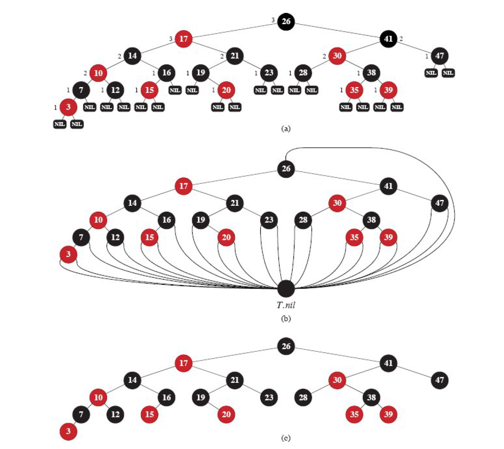

摸鱼摸了大半个月了，开始学大黑书《算法导论》，从这篇博客开始，后续会不断更新算法导论中比较有用的数据结构或算法的代码部分（主要），理论部分会进行一些讲解，但书上出现过的就不会再重复说明。

### **红黑树性质与介绍**

红黑树是一种平衡二叉树的实现方法，相比AVL树，在删除操作中他的统计效率会更高，最多进行三次$O(1)$的旋转，而AVL树在最坏情况下，旋转的次数为$O(logn)$。

红黑树查找、插入、删除的时间复杂度最坏为 $O(logn)$

<!-- more -->

红黑树的五个性质：

1. 每个节点要么是红的，要么是黑的；
2. 根节点是黑的；
3. 每个叶子节点（叶子节点即指树尾端NIL指针或NULL结点）都是黑的；
4. 每个红色节点必须有两个黑色的子节点；
5. 从任一节点到其每个叶子节点的所有路径都包含相同数目的黑色节点（这个性质保证了：最长路径长度不超过最短路径长度的2倍）

由于红黑树比较难实现，这里将相关代码也进行部分展示。

### **红黑树节点定义**

为方便实现红黑树，这里需要定义五个成员变量，分别为：

1. 节点颜色
2. 节点的数据域（这里是实现了类似STL中map的键值对数据域）
3. 父节点与左右孩子节点

```c++
template<typename K, typename V>
class RBTreeNode {
public:

	// 键值对类型
	using Pair = pair<K, V>;

	// 成员变量
	Color color;
	Pair kv;
	RBTreeNode<K, V>* parent;
	RBTreeNode<K, V>* left;
	RBTreeNode<K, V>* right;

	// 默认构造函数
	RBTreeNode() :color(Color::RED), kv(make_pair(K(), V())), parent(nullptr), left(nullptr), right(nullptr) {};

	// 根据键值对的构造函数
	RBTreeNode(K key, V val) : color(Color::RED), kv(make_pair(key, val)), parent(nullptr), left(nullptr), right(nullptr) {};

	// 默认新插入的节点都是红色节点
};
```

### **红黑树完整实现**



算法导论中给出了如上的三种数据结构类型，实际实现应选用(a)、(b)两图中的结构，(c)仅是为在书中方便表示而采用的简便写法。为提升数据结构的空间效益，本文使用的结构与(b)图相似，即：节点若没有孩子节点或父节点，则其对应的指针均指向同一个哨兵节点，该哨兵节点为黑色节点。

#### 旋转操作

红黑树的旋转操作类似于AVL树，这里不再赘述。

#### 插入操作

1. 按照二叉平衡树的方式插入红黑树节点（节点默认为红色节点）
2. 检测新节点的插入是否会影响红黑树的五个性质

#### 删除操作

类似于插入操作，但在删除前需要判断待删除节点是否存在，若不存在，应提前返回。

#### **完整代码**

```C++
template<typename K, typename V>
class RBTree {

	// 公有成员
public:

	// 键值对类型
	using Pair = pair<K, V>;

	// 节点指针类型
	using pointer = RBTreeNode<K, V>*;

	// 构造函数，起始时，红黑树为空
	RBTree() {
		nil = new RBTreeNode<K, V>();
		nil->left = nil->right = nil->parent = nil;
		root = nil;
		nil->color = Color::BLACK;
	}

	// 析构函数
	~RBTree() {
		destroy(root);
		delete nil;
		nil = nullptr;
	}

	// 插入新节点
	void insert(const K& key, const V& val) {

		// 指向哨兵与根节点
		pointer p = nil;
		pointer s = root;

		// 遍历到合适的位置
		while (s != nil) {

			// 当这次插入的键已经存在过的时候，忽略这次插入
			if (key == s->kv.first) return;

			// p始终设置为s的父节点
			p = s;
			if (key < s->kv.first) s = s->left;
			else if (key > s->kv.first) s = s->right;
		}

		// s此时为nil
		s = new RBTreeNode<K, V>(key, val);
		s->left = s->right = s->parent = nil;

		// 当RBTree为空时
		if (p == nil) {
			root = s;
			root->parent = p;
		}
		// 当RBTree不为空时
		else {
			if (key < p->kv.first) p->left = s;
			else if (key > p->kv.first) p->right = s;
			s->parent = p;
		}

		// 红黑树平衡
		insert_fixed(s);

	}

	// 插入新节点
	void insert(K&& key, const V& val) {

		// 指向哨兵与根节点
		pointer p = nil;
		pointer s = root;

		// 遍历到合适的位置
		while (s != nil) {

			// 当这次插入的键已经存在过的时候，忽略这次插入
			if (key == s->kv.first) return;

			// p始终设置为s的父节点
			p = s;
			if (key < s->kv.first) s = s->left;
			else if (key > s->kv.first) s = s->right;
		}

		// s此时为nil
		s = new RBTreeNode<K, V>(key, val);
		s->left = s->right = s->parent = nil;

		// 当RBTree为空时
		if (p == nil) {
			root = s;
			root->parent = p;
		}
		// 当RBTree不为空时
		else {
			if (key < p->kv.first) p->left = s;
			else if (key > p->kv.first) p->right = s;
			s->parent = p;
		}

		// 红黑树平衡
		insert_fixed(s);

	}

	// 插入新节点
	void insert(const K& key, V&& val) {

		// 指向哨兵与根节点
		pointer p = nil;
		pointer s = root;

		// 遍历到合适的位置
		while (s != nil) {

			// 当这次插入的键已经存在过的时候，忽略这次插入
			if (key == s->kv.first) return;

			// p始终设置为s的父节点
			p = s;
			if (key < s->kv.first) s = s->left;
			else if (key > s->kv.first) s = s->right;
		}

		// s此时为nil
		s = new RBTreeNode<K, V>(key, val);
		s->left = s->right = s->parent = nil;

		// 当RBTree为空时
		if (p == nil) {
			root = s;
			root->parent = p;
		}
		// 当RBTree不为空时
		else {
			if (key < p->kv.first) p->left = s;
			else if (key > p->kv.first) p->right = s;
			s->parent = p;
		}

		// 红黑树平衡
		insert_fixed(s);

	}

	// 插入新节点
	void insert(K&& key, V&& val) {

		// 指向哨兵与根节点
		pointer p = nil;
		pointer s = root;

		// 遍历到合适的位置
		while (s != nil) {

			// 当这次插入的键已经存在过的时候，忽略这次插入
			if (key == s->kv.first) return;

			// p始终设置为s的父节点
			p = s;
			if (key < s->kv.first) s = s->left;
			else if (key > s->kv.first) s = s->right;
		}

		// s此时为nil
		s = new RBTreeNode<K, V>(key, val);
		s->left = s->right = s->parent = nil;

		// 当RBTree为空时
		if (p == nil) {
			root = s;
			root->parent = p;
		}
		// 当RBTree不为空时
		else {
			if (key < p->kv.first) p->left = s;
			else if (key > p->kv.first) p->right = s;
			s->parent = p;
		}

		// 红黑树平衡
		insert_fixed(s);

	}

	// 删除结点
	void remove(const K& key) {

		pointer t;

		// 查找到指定结点
		if ((t = search(root, key)) != nil) remove(t);
		else cout << "Key is not exist." << endl;

	}

	// 删除结点
	void remove(K&& key) {

		pointer t;

		// 查找到指定结点
		if ((t = search(root, std::move(key))) != nil) remove(t);
		else cout << "Key is not exist." << endl;

	}

	// 查找键值对
	V find(const K& key) const {
		return search(root, key)->kv.second;
	}

	// 查找键值对
	V find(K&& key) const {
		return search(root, std::move(key))->kv.second;
	}

	// 索引operator[]
	// 返回键对应的值
	V& operator[](const K& key) {

		pointer t = search(root, key);
		if (t != nil) return t->kv.second;
		else {
			insert(key, std::move(V()));
			return search(root, key)->kv.second;
		}

	}

	// 索引operator[]
	// 返回键对应的值
	V& operator[](K&& key) {

		pointer t = search(root, std::move(key));
		if (t != nil) return t->kv.second;
		else {
			insert(std::move(key), std::move(V()));
			return search(root, std::move(key))->kv.second;
		}

	}

	// 打印所有节点
	void print(void) {
		show(root);
	}


	// 私有成员
private:

	// 根节点
	pointer root;

	// 哨兵节点
	pointer nil;

	// 析构函数辅助函数
	void destroy(pointer& node) {
		if (node == nil) return;
		if (node->left != nil) destroy(node->left);
		if (node->right != nil) destroy(node->right);
		delete node;
		node = nullptr;
	}

	// 打印函数辅助函数
	void show(pointer& node) {
		if (node != nil) {
			show(node->left);
			cout << "key: " << node->kv.first << ", " << "value: " << node->kv.second << "; " << endl;
			show(node->right);
		}
	}

	// 左旋转
	void leftRotation(pointer z) {
		
		// 用y指向要转动的z结点
		pointer y = z->right;

		z->right = y->left;
		if (y->left != nil) y->left->parent = z;
		y->parent = z->parent;


		// 交换y与z位置
		// 当z就是根节点时
		if (root == z) root = y;
		else if (z == z->parent->left) z->parent->left = y;
		else z->parent->right = y;

		y->left = z;
		z->parent = y;

	}

	// 右旋转
	void rightRotation(pointer z) {

		// 用y指向要转动的z结点
		pointer y = z->left;

		z->left = y->right;
		if (y->right != nil) y->right->parent = z;
		y->parent = z->parent;

		// 交换y与z位置
		// 当z就是根节点时
		if (root == z) root = y;
		else if (z == z->parent->left) z->parent->left = y;
		else z->parent->right = y;

		y->right = z;
		z->parent = y;

	}

	// 插入后的调整函数
	void insert_fixed(pointer s) {

		// 叔节点
		pointer uncle;

		// 父节点为红色
		while (s->parent->color == Color::RED) {
			
			// 父节点是左结点
			if (s->parent == s->parent->parent->left) {

				uncle = s->parent->parent->right;

				// 叔节点也是红色
				if (uncle->color == Color::RED) {

					// 父节点和叔节点都变为黑色
					s->parent->color = Color::BLACK;
					uncle->color = Color::BLACK;

					// 祖父结点变成红色
					s->parent->parent->color = Color::RED;

					// s指针指向祖父结点，下一次循环判断祖父结点的父节点是否为红色
					s = s->parent->parent;

				}

				// 没有叔节点或叔节点为黑色
				else {

					// 调整的节点为右结点
					if (s == s->parent->right) {

						// 左转父节点
						s = s->parent;
						leftRotation(s);

					}

					// 若调整的节点在左节点，将父节点变为黑色，祖父结点变成红色，再右转祖父结点
					s->parent->color = Color::BLACK;
					s->parent->parent->color = Color::RED;
					rightRotation(s->parent->parent);

				}

			}
			else {

				// 父节点为右节点
				if (s->parent == s->parent->parent->right) {

					uncle = s->parent->parent->left;

					// 叔节点也是红色
					if (uncle->color == Color::RED) {

						// 父节点和叔节点都变为黑色
						s->parent->color = Color::BLACK;
						uncle->color = Color::BLACK;

						// 祖父结点变成红色
						s->parent->parent->color = Color::RED;

						// s指针指向祖父结点，下一次循环判断祖父结点的父节点是否为红色
						s = s->parent->parent;

					}
					// 没有叔节点
					else {

						if (s == s->parent->left) {
							s = s->parent;
							rightRotation(s);
						}

						s->parent->color = Color::BLACK;
						s->parent->parent->color = Color::RED;
						leftRotation(s->parent->parent);

					}

				}

			}

		}

		// 根节点始终为黑色
		root->color = Color::BLACK;

	}

	// 内部查找函数
	pointer search(pointer node, const K& key) const {
		
		// 结点为空
		if (node == nil) return nil;
		// 以大小来判断
		if (node->kv.first == key) return node;
		if (key < node->kv.first) return search(node->left, key);
		if (key > node->kv.first) return search(node->right, key);

	}

	// 内部查找函数
	pointer search(pointer node, K&& key) const {

		// 结点为空
		if (node == nil) return nil;
		// 以大小来判断
		if (node->kv.first == key) return node;
		if (key < node->kv.first) return search(node->left, std::move(key));
		if (key > node->kv.first) return search(node->right, std::move(key));

	}

	// 最大元素的指针
	pointer maximum(pointer x) {
		if (x->right == nil) return x;
		return maximum(x->right);
	}

	// 最小元素的指针
	pointer minimum(pointer x) {
		if (x->left == nil) return x;
		return minimum(x->left);
	}

	// 将u的子节点指向u的指针改变指向v，将v的父节点指针改变指向u的父节点
	void transplant(pointer u, pointer v) {

		// 指针改变指向
		if (u->parent == nil) root = v;
		else if (u == u->parent->left) u->parent->left = v;
		else u->parent->right = v;
		v->parent = u->parent;

	}

	// 内部删除函数
	void remove(pointer z) {

		pointer x = nil;
		pointer y = z;
		Color ycolor = y->color;

		// z只有右孩子
		if (z->left = nil) {
			x = z->right;
			transplant(z, z->right);
		}
		// z只有左孩子
		else if (z->right == nil) {
			x = z->left;
			transplant(z, z->left);
		}
		else {
			y = minimum(z->right);
			ycolor = y->color;
			x = y->right;
			if (y->parent == z) x->parent = y;
			else {
				transplant(y, y->right);
				y->right = z->right;
				y->right->parent = y;
			}
			transplant(z, y);

			// 改变指向
			y->left = z->left;
			z->left->parent = y;
			y->color = z->color;
		}

		if (ycolor == Color::BLACK) remove_fixed(x);

	}

	//红黑树删除调整
	void remove_fixed(pointer x) {

		//当结点x不为根并且它的颜色不是黑色
		while (x != root && x->color == Color::BLACK) {

			//x在左子树
			if (x == x->parent->left) {

				//w是x的兄结点
				pointer w = x->parent->right; 

				//情况1
				if (w->color == Color::RED) {
					w->color = Color::BLACK;
					x->parent->color = Color::RED;
					leftRotation(x->parent);
					w = x->parent->right;
				}

				//情况2
				if (w->left->color == Color::BLACK && w->right->color == Color::BLACK) {
					w->color = Color::RED;
					x = x->parent;
				}
				else {

					//情况3
					if (w->right->color == Color::BLACK) {
						w->color = Color::RED;
						w->left->color = Color::BLACK;
						rightRotation(w);
						w = x->parent->right;
					}

					//情况4
					w->color = w->parent->color;
					w->parent->color = Color::BLACK;
					w->right->color = Color::BLACK;
					leftRotation(x->parent);
					x = root; //结束循环

				}

			}
			// x在右子树
			else {

				pointer w = x->parent->left;

				//情况1
				if (w->color == Color::RED) {
					w->parent->color = Color::RED;
					w->color = Color::BLACK;
					rightRotation(x->parent);
					w = x->parent->left;
				}

				//情况2
				if (w->right->color == Color::BLACK && w->right->color == Color::BLACK) {
					w->color = Color::RED;
					x = x->parent;
				}
				else {

					//情况3
					if (w->left->color == Color::BLACK) {
						w->right->color = Color::BLACK;
						w->color = Color::RED;
						leftRotation(w);
						w = x->parent->left;
					}

					//情况4
					w->color = x->parent->color;
					x->parent->color = Color::BLACK;
					w->left->color = Color::BLACK;
					rightRotation(x->parent);
					x = root; //结束循环

				}

			}

		}

		// 改变颜色
		x->color = Color::BLACK;

	}

};
```

PS：具体理论请参考算法导论第174~192页
