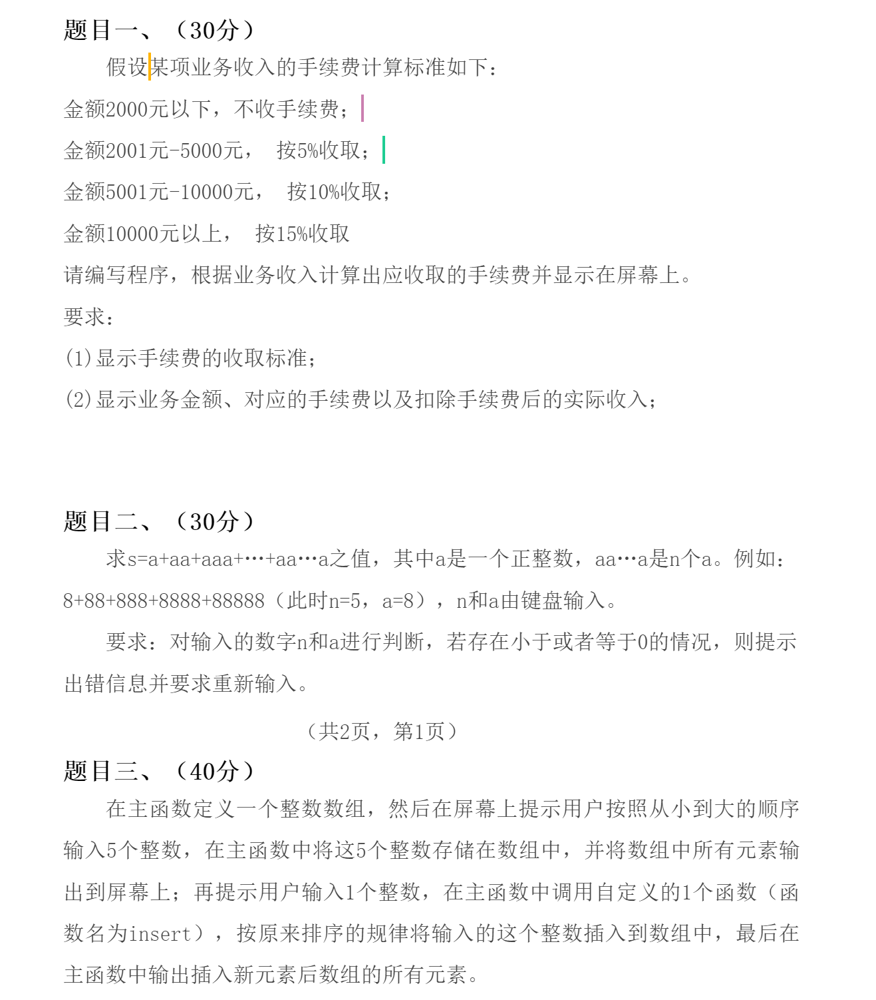

现在是2022年12月22日下午15点55分，在这里先祝大家冬至快乐！！！又快到新的一年长大一岁啦！

虽然但是，大一期末人现在还在期末周复习阶段，现在也刚好是我的第一科考试，程序设计基础实验，距离我答完题已经过去了半个多小时。现在由于是线上考试非常的无聊非常的困。我决定给自己找点事情做，那就是来码这篇博客。

<!-- more -->

没想到第一篇生活类blog来得这么快，现在是一个又困又不能睡觉的状态。

由于疫情原因，我们考试都是线上进行（有的学校等到下学期才考试真的很羡慕），家里也有已经阳性的人所以也挺害怕自己在考试周倒下了。

希望冬至过后，疫情退散，新的一年大家都能好起来！！！

待会可能还要留点时间检查所以就不写太多了，这个博客还是要以技术为主（）也把考试题目放上来吧。



##### **题目一**

这题还挺见的，有点歧义。

```c++
#include<iostream>
using namespace std;
double x;
// 获取手续费的函数
double getSub(double x) {
	if (x <= 2000) return 0;
	else if (x <= 5000) return 0.05 * (x - 2000);
	else if (x <= 10000) return 0.1 * (x - 5000) + getSub(5000);
	else return 0.15 * (x - 10000) + getSub(10000);
}
// 这里题目有歧义
// 到底是超过了金额就直接按照该金额的百分比去算
// 或者是超出部分按超出部分计算，未超出部分按未超出指定金额去算
// 如果是第一种算法的话，2001获取的实际收入小于2000的实际收入(这显然不合理)
// 因此我们按照第二种算法计算手续费
int main(void) {
	// 1. 显示手续费的收取标准
	cout << "金额2000元以下，不收手续费" << endl;
	cout << "金额2001元-5000元，按5%收取" << endl;
	cout << "金额5001元-10000元，按10%收取" << endl;
	cout << "金额10000元以上，按15%收取" << endl;

	// 输入
	cout << "请输入业务收入：" << endl;
	cin >> x;

	// 2. 显示业务金额、对应的手续费和实际收入
	cout << "业务金额：" << x << endl;
	double sub = getSub(x);
	cout << "对应的手续费：" << sub << endl;
	cout << "实际收入：" << x - sub << endl;
	return 0;
}
```

##### **第二题**

这题也见，也有歧义！

这里a如果不是个位数咋办？

```c++
#include<iostream>
#include<cmath>
using namespace std;
int n, a;
// 求x的位数
int digit(int x) {
	int dig = 0;
	for (; x; x /= 10, ++dig);
	return dig;
}
// 求s
int getS(int a, int n) {
	int s = a;
	int tmp = a;
	// a可能不是个位数
	int dig = digit(a);
	while (--n) {
		// tmp为新增的每一项
		tmp *= pow(10, dig);
		tmp += a;

		// 累加至s中
		s += tmp;
	}
	return s;
}
int main(void) {

	cout << "请分别输入n和a：" << endl;
	cin >> n >> a;

	// 输入非法
	while (n <= 0 || a <= 0) {
		cout << "输入非法，请重新输入：" << endl;
		cin >> n >> a;
	}

	// 显示计算后的值
	cout << "s的值等于：" << endl;
	cout << getS(a, n) << endl;
	return 0;
}
```

##### **第三题**

```c++
#include<iostream>
using namespace std;
int a[6], x;
void insert(int* a, int x) {
	// 找到要插入的位置
	int idx;
	for (idx = 0; idx < 5; ++idx) {
		if (a[idx] > x) break;
	}

	// 向后移动一位
	for (int i = 4; i >= idx; --i) a[i + 1] = a[i];

	// 将新数据插入指定位置
	a[idx] = x;
}
int main(void) {
	// 输入原数组
	cout << "请输入从小到大顺序的5个整数:" << endl;
	for (int i = 0; i < 5; ++i) cin >> a[i];

	// 输出原数组
	cout << "原数组:" << endl;
	for (int i = 0; i < 5; ++i) cout << a[i] << ' ';
	cout << endl;
	
	// 输入插入元素并插入数组中
	cout << "请输入你要插入的元素:" << endl;
	cin >> x;
	insert(a, x);

	// 输出插入后的数组
	cout << "插入后的数组" << endl;
	for (int i = 0; i < 6; ++i) cout << a[i] << ' ';
	return 0;
}
```

~~没有出乎我的意料，有歧义，简单但恶心你，让你在出分前睡不好觉~~

第三题本来还想写个二分，想了想还是不炫技了。

好啦摸鱼结束！开始检查然后交卷啦！！！

---

update: 2022/12/22 16:56

考完问了对象and几个朋友，确实分成了两波人，所以是题目问题。
