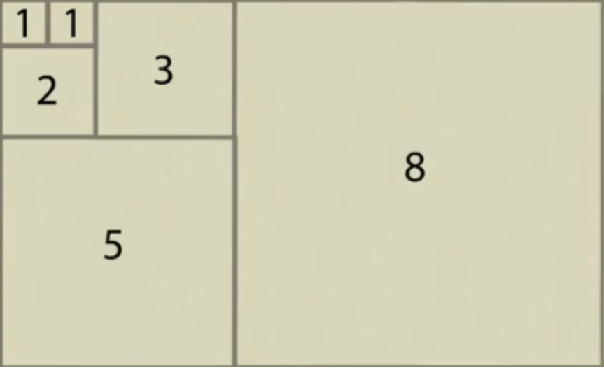

现在是2023年1月28日，在这里也提前祝大家元宵节快乐！

这篇博客用于更新2023年2月6日CSOJ寒假训练赛第七场的题目与题解，为防止赛题泄漏，本篇博客会到比赛当天晚上的22:30才会公开全部内容。

本次训练赛更多考察算法思维，而非考察固定的模板与套路，持续更新中，敬请期待！

<!-- more -->

---
update: 2023-1-29


万恶的出题人.jpg

---
update: 2023-2-6

## **A题：cy老师的训练赛**



签到题，暴力模拟即可。

时间复杂度：$O(nm)$

```c++
#include<iostream>
using namespace std;
const int N = 1e3 + 10;
int n, m, a[N], b[N], c[N];
int main(void) {
	cin >> n >> m;
	for (int i = 1; i <= n; ++i) cin >> a[i];
	for (int i = 1; i <= m; ++i) cin >> b[i];
	for (int i = 1; i <= m; ++i) cin >> c[i];
	for (int i = 1; i <= n; ++i) {
		for (int j = 1; j <= m; ++j) {
			if (c[j] > 0) {
				if (b[j] >= a[i]) ++b[j], ++c[j];
				else --c[j];
			}
		}
	}
	for (int i = 1; i <= m; ++i) {
		cout << b[i] << ' ';
	}
	return 0;
}
```



## **B题：魔法小公主的蛋糕party**



这题是思维题，代码量很少，但是其实证明起来比较巧妙。

设$b[i] = \frac{a[i]}{a[i-1]}$，则$b[i+1] = \frac{a[i+1]}{a[i]}$，当$a[i]$变为$\frac{a[i+1]a[i-1]}{a[i]}$时，有$b^{'}[i] = \frac{a[i+1]}{a[i]} = b[i+1]$，$b^{'}[i+1] = \frac{a[i]}{a[i - 1]} = b[i]$（其中$b^{'}[i]$是对$a[i]$使用魔法后的$b[i]$）。

因此，对$a[i]$使用魔法，相当于交换$b[i]$与$b[i+1]$。

正解即为对$b[i]$进行排序后，重新从$a[1]$开始构造$a[i]$。

时间复杂度：$O(nlogn)$

```c++
#include<iostream>
#include<iomanip>
#include<algorithm>
using namespace std;
const int N = 2e5 + 10;
int n;
double a[N], b[N], s;
int main(void) {
	cin >> n;
	for (int i = 1; i <= n; ++i) {
		cin >> a[i];
		if (i != 1) b[i] = a[i] / a[i - 1];
	}
	sort(b + 2, b + n + 1, [](double i, double j) { return i > j; });
	s = a[1];
	for (int i = 2; i <= n; ++i) {
		a[i] = a[i - 1] * b[i];
		s += a[i];
	}
	cout << fixed << setprecision(6) << s << endl;
	return 0;
}
```



## **C题：谁是赌怪？**



**感谢队友hy的题解**：

设当前已选的最大值为$p$，数列当前最左端为$a[l]$，当前最右端为$a[r]$；

我们需要根据$a[l],a[r]$，和$p$之间的大小来分情况讨论；

**第一种情况**：$a[l]>p , a[r]>p$:

假设这里的$a[l]>a[r]$（小于的情况可以类比，假设只是为了方便理解）

此时有两个选牌方式：

$A$：如果选$a[l]$，因为$a[l]>a[r]$，根据规则（只能越选越大），$a[r]$那一端则永远不可能被选接下来只需从$a[l]$那一端一直选就会分出胜负；

$B$：而如果选择$a[r]$不选$a[l]$，那么就轮到下一个人做同样的选择了；

所以，我们可以先判断，如果从大一点的那一端开始选，能否直接结束游戏，如果可以，那就输出结果，如果不行，那就选择小一点的那一端，然后轮到下一个人选；

还有一种情况：$a[l]==a[r]$，那么从$a[l]$开始判断一次，从$a[r]$开始也要判断一次，只要有一次能赢，就输出当前轮到先手还是后手；如果都会输，那就输出相反的结果；

**第二种情况**：$a[l]$ 和$a[r]$中只有一个大于$p$：

谁大于$p$那就只能从那一端开始，一直选，直到分出胜负，输出结果即可；

**第三种情况**：$a[l]<=p,a[r]<=p$：

现在轮到谁，那谁就输了；

（牌堆会被全部取完的情况只有：牌堆初始只有一张牌的时候）

完整代码如下：

```c++
#include<iostream>
#include<cstring>
using namespace std;
int a[100];
int b[10000];
void yuchuli() {//按照ASCLL码预处理一下对应字符的大小
	for (int i = '3';i <= '9';i++) a[i] = i - '2';
	a[int('J')] = 8;
	a[int('Q')] = 9;
	a[int('K')] = 10;
	a[int('A')] = 11;
	a[int('2')] = 12;
}
bool go1(int l,int r) {//假设从牌顶开始一人取一张，判断当前取牌的人能否直接获胜
	int c = 1;
	while (l < r) {
		if (a[b[l]] < a[b[l + 1]]) {
			l++;
			c++;
		}
		else break;
	}
	if (c % 2 == 0) return false;else return true;
}
bool go2(int l,int r) {//假设从牌底开始一人取一张，判断当前取牌的人能否直接获胜
	int c = 1;
	while (l < r) {
		if (a[b[r]] < a[b[r - 1]]) {
			r--;
			c++;
		}
		else break;
	}
	if (c % 2 == 0) return false;else return true;
}
void write1(int o) {
	if (o == 1) cout << 1 << endl;
	else cout << 2;
}
int main() {
	int n;
	cin >> n;
	yuchuli();
	for (int i = 1;i <= n;i++) {
		char e;
		cin >> e;
		b[i] = int(e);
	}
	int l = 1, r = n;
	int o = 1, p = 0;//o记录此时是轮到先手的人选还是后手的人选，1代表先，-1代表后，  p记录上一张被选的牌大小
	while (1) {
		if (a[b[l]] > p && a[b[r]] > p) {//牌顶和牌底都可以选择
			if (a[b[l]] > a[b[r]]) {//牌顶更大
				if (go1(l, r) == true) {
					write1(o);
					break;
				}
				else {
					p = a[b[r]];
					r--;
				}
			}
			else if (a[b[l]] < a[b[r]]) {//牌底更大
				if (go2(l, r) == true) {
					write1(o);
					break;
				}
				else {
					p = a[b[l]];
					l++;
				}
			}
			else {//一样大，直接可以结束了
				if (go1(l, r) == true) {
					write1(o);break;
				}
				if (go2(l, r) == true) {
					write1(o);break;
				}
				write1(-o);break;//如果运行到这里还没有break,说明从左右两端开始都会输，那此刻就是此时必输
			}
		}
		else {//说明牌顶和牌底，至少有一个小于等于当前最大
			if (a[b[l]] > p) {//只有左边能选，那直接从左边开始判断
				if (go1(l, r) == true) write1(o);else write1(-o);
				break;
			}
			if (a[b[r]] > p) {
				if (go2(l, r) == true) write1(o);else write1(-o);
				break;
			}
			write1(-o);//二者均小于p;
			break;
		}
		o = o * -1;
	}
	
	return 0;
}
```



## **D题：重启！密码！**



比较巧妙的$dp$题

设$dp[i][j]$表示将字符串$A$的前$i$位改为字符串$B$的$j$位所需要的最短时间。

若$A[i]==B[j]$（$A$的第$i+1$位与$B$的第$j+1$位），则$dp[i+1][j+1]=dp[i][j]$；

若$A[i]!=b[j]$，分三种情况：

1. $A$的前$i$位已改为$B$的前$j$位，则需要多加一次修改操作：将$A[i]$改为$B[j]$，时间为$dp[i][j]+1$
2. $A$的前$i+1$位已改为$B$的前$j$位，则需要多加一次输入操作：输入$B[j]$，时间为$dp[i+1][j]+1$
3. $A$的前$i$位已改为$B$的前$j+1$位，则需要多加一次删除操作：删除$A[i]$，时间为$dp[i][j+1]+1$

故$dp[i+1][j+1]=min(dp[i][j],dp[i+1][j],dp[i][j+1])+1$

完整代码如下：

时间复杂度：$O(|A|\times|B|)$

```c++
#include<bits/stdc++.h>
using namespace std;

string s1, s2;
int n, i, j;
int dp[5500][5500];

int main() {
	cin >> s1 >> s2;
	int len1 = s1.length(), len2 = s2.length();
	for (i = 0; i <= len2; i++) dp[0][i] = i;
	for (i = 1; i <= len1; i++) dp[i][0] = i;
	for (i = 1; i <= len1; i++) for (j = 1; j <= len2; j++) {
		if (s1[i - 1] == s2[j - 1]) dp[i][j] = dp[i - 1][j - 1];
		else dp[i][j] = min(min(dp[i - 1][j - 1] + 1, dp[i][j - 1] + 1), dp[i - 1][j] + 1);
	}
	cout << dp[len1][len2];
}
```



## **E题：会告密的小狗**



也是一道需要思维量的题。

对于一个区间$ [ i , j ]$，我们可以发现，若$s[i]==s[j]$，翻转$ [ i , j ]$ 与翻转$[ i+1 , j-1 ]$ 的意义相同，所以我们只需要统计有多少$s[i]==s[j]$，求出无意义翻转个数。对于每个字符（$a$~$z$）分别统计其个数，对于字符$a$产生的无意义翻转共有个$C_{num[a]}^2$（$num[a]$为字符串中a的数量）。$ans=C_{s.len}^2-$ 无意义翻转个数。

最后记得加上哄红发现不了小狗的情况噢！（原字符串也算一种）

完整代码如下：

时间复杂度：$O(t \times |s|)$

```c++
#include<iostream>
#include<cstring>
using namespace std;
typedef long long LL;
const int N = 2e5 + 10;
char str[N];
LL t, ans, box[30];
int main(void) {
	cin >> t;
	while (t--) {
		ans = 0;
		memset(box, 0, sizeof box);
		scanf("%s", str + 1);
		LL len = strlen(str + 1);
		for (int i = 1; i <= len; ++i) {
			box[str[i] - 'a']++;
		}
		ans = len * (len - 1) / 2;
		for (int i = 0; i < 26; ++i) {
			ans -= (box[i] * (box[i] - 1) / 2);
		}
		cout << ans + 1 << endl;
	}
	return 0;
}
```



## **F题：斐波那契的密码**



斐波那契？纯纯数学题？其实是防$AK$题。

看到数据范围：（$1 \le l_1 \le r_1 \le 10^9$，$1 \le l_2 \le r_2 \le 10^9$）

肯定是要用矩阵快速幂求$f(n)$，不然肯定$TLE$啦。

重点在于怎么求分母和分子，直接通过式子去求的话时间复杂度为：$O(t \times max(r_1-l_1,r_2-l_2))$

很遗憾，这样是过不了的。

我们需要用下面的方法简化式子。

**分子**是平方和：

由于我们这里的类斐波那契数列满足：$f(0)=f(1)=n$

平方和，类似于普通的斐波那契数列，如下图：



只需要将单位改为$n$即可，即$\Sigma_{i=1}^{n}f^2(i) = f(n) \times f(n+1)$

故分子即为：$f(r_1) \times f(r_1 + 1) - f(l_1 - 1) \times f(l_1)$

**分母**是直接求和：

即：$\Sigma_{i=1}^{n}f(i)=f(1)+f(2)+…+f(n)$

$\Sigma_{i=1}^{n}f(i)+f(2)=f(2)+f(1)+f(2)+f(3)+…+f(n)=f(n+2)$

因此：$\Sigma_{i=1}^{n}f(i)=f(n+2)-f(2)$

故分母即为：$f(r_2+2)-f(l_1+1)$

注意，这里是在模$10^9+7$的条件下进行计算的，因此：分母需要求逆后再与分子相乘，而不能直接相除。

完整代码：$O(t \times log(max(r_1,r_2)))$

```c++
#include<iostream>
using namespace std;
typedef long long LL;
const int N = 2;
const LL mod = 1e9 + 7;
class Matrix {
public:
	LL a[N][N];
	// 默认构造为零矩阵
	Matrix() {
		for (int i = 0; i < N; ++i) {
			for (int j = 0; j < N; ++j) {
				a[i][j] = 0;
			}
		}
	}
	// 矩阵乘法
	Matrix operator*(Matrix T) {
		Matrix ans;
		for (int i = 0; i < N; ++i) {
			for (int j = 0; j < N; ++j) {
				for (int k = 0; k < N; ++k) {
					ans.a[i][j] = (ans.a[i][j] + a[i][k] * T.a[k][j] % mod) % mod;
				}
			}
		}
		return ans;
	}
};
// 矩阵快速幂
Matrix qmi(Matrix T, LL k) {
	Matrix ans;
	for (int i = 0; i < N; ++i) ans.a[i][i] = 1;
	while (k) {
		if (k & 1) ans = ans * T;
		T = T * T;
		k >>= 1;
	}
	return ans;
}
LL n, f0, f1, t, l1, l2, r1, r2;
// 求斐波那契的第x项（从第0项开始）
LL f(LL x) {
	if (x == 0) return f0;
	Matrix T, ans;
	T.a[0][0] = T.a[0][1] = T.a[1][0] = 1;
	ans = qmi(T, x - 1);
	LL a = ans.a[0][0], b = ans.a[0][1];
	return (a * f1 % mod + b * f0 % mod) % mod;
}
// 整数求逆
LL inv(LL x) {
	LL k = mod - 2;
	LL ans = 1;
	while (k) {
		if (k & 1) ans = (ans * x) % mod;
		x = (x * x) % mod;
		k >>= 1;
	}
	return ans;
}
// l1 ~ r1: f[r1] * f[r1 + 1] - f[l1 - 1] * f[l1] 
// l2 ~ r2: (f[r2 + 2] - f[2]) - (f[l2 + 1] - f[2]) = f[r2 + 2] - f[l2 + 1] 
int main(void) {
	cin >> n;
	f0 = f1 = n;
	cin >> t;
	while (t--) {
		cin >> l1 >> r1 >> l2 >> r2;
		LL up = (f(r1) * f(r1 + 1) % mod - f(l1 - 1) * f(l1) % mod + mod) % mod;
		LL down = (f(r2 + 2) - f(l2 + 1) + mod) % mod;
		cout << up * inv(down) % mod << endl;
	}
	return 0;
}
```


